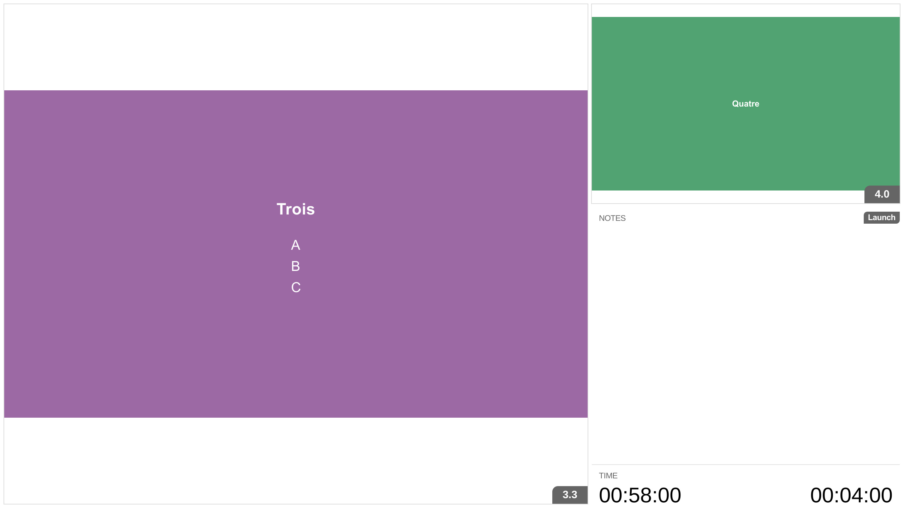

= bespoke-onstage
Dan Allen <https://github.com/mojavelinux>
// Settings:
:idprefix:
:idseparator: -
:experimental:
//ifdef::env-github[:badges:]
// URIs:
:uri-raw-file-base: https://raw.githubusercontent.com/opendevise/bespoke-onstage/master

ifdef::badges[]
image:https://img.shields.io/npm/v/bespoke-onstage.svg[npm package, link=https://www.npmjs.com/package/bespoke-onstage]
image:https://img.shields.io/travis/opendevise/bespoke-onstage/master.svg[Build Status (Travis CI), link=https://travis-ci.org/opendevise/bespoke-onstage]
endif::[]

An adapter for using the onstage shell (aka presenter mode) from http://paulrouget.com/dzslides[DZSlides] to drive a http://markdalgleish.com/projects/bespoke.js[Bespoke.js] presentation.



NOTE: A modified version of the onstage.html file from DZSlides is included in this plugin, but this plugin also works if you use the original file from DZSlides.

== Example

//http://opendevise.github.io/bespoke-onstage[View the demo] online.

This repository includes a demo folder that shows this plugin in action.
To view it locally, you first need to clone this repository:

 $ git clone https://github.com/opendevise/bespoke-onstage && cd bespoke-onstage

Next, install the dependencies inside the project folder using npm:

 $ npm install

Next, visit the file [path]_demo/onstage.html_ in your browser.
In the prompt that appears, type [input]_index.html_ to see the adapter in action.

Alternatively, in the prompt you can type the path (either absolute or relative to the [path]_demo_ folder) to any Bespoke.js presentation that has this plugin enabled.

== Download

Download the {uri-raw-file-base}/dist/bespoke-onstage.min.js[production mode version] or the {uri-raw-file-base}/dist/bespoke-onstage.js[development mode version], or use a package manager (NOT YET AVAILABLE!).

=== npm

```bash
$ npm install bespoke-onstage
```

=== Bower

```bash
$ bower install bespoke-onstage
```

== Usage

This plugin is shipped in a https://github.com/umdjs/umd[UMD format], meaning it is available as a CommonJS/AMD module or as a browser global.

For example, when using CommonJS modules:

```js
var bespoke = require('bespoke'),
  onstage = require('bespoke-onstage');

bespoke.from('.deck', [
  onstage()
]);
```

When using a browser global:

```js
bespoke.from('.deck', [
  bespoke.plugins.onstage()
]);
```

Once the onstage plugin is added, open the file [path]_node_modules/bespoke-onstage/demo/onstage.html_ and enter the absolute URL to your presentation.
You will see a presenter console that you can use to drive the presentation in another browser window.

Launch the presentation window by clicking on btn:[Launch].

== License

http://en.wikipedia.org/wiki/MIT_License[MIT License]
